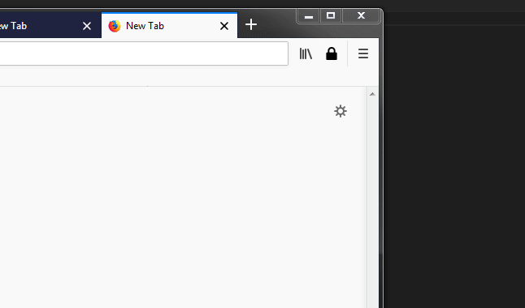

# pwgen reloaded

## What it does

A firefox addon that generates a password and copies it to the clipboard

## install

On amo!  
[https://addons.mozilla.org/firefox/addon/pwgen-reloaded/](https://addons.mozilla.org/firefox/addon/pwgen-reloaded/)

## develop

Clone this repo, open firefox on [about:debugging](about:debugging) and load the extension by selecting the cloned folder.  
Start coding!

## make a release

zip the src folder and upload to https://addons.mozilla.org/
